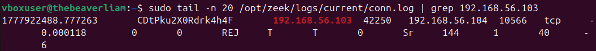
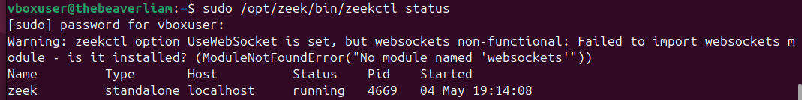

# zeek-soc-lab

## Overview
This project demonstrates a home-built Security Operations Center (SOC) lab using Zeek to monitor and analyze network traffic between virtual machines.

The lab simulates attacker behavior using Kali Linux and captures traffic on an Ubuntu-based Zeek sensor.

---

## Architecture
Kali Linux (Attacker) → Ubuntu (Zeek Sensor) → Log Files

- Kali generates traffic (ping, nmap, hping)
- Ubuntu captures traffic using Zeek
- Zeek converts packet data into structured logs (e.g., conn.log, dns.log)

---

## Technologies Used
- Zeek (Network Security Monitoring)
- VirtualBox (Virtualization)
- Kali Linux (Attack Simulation)
- Ubuntu (Sensor and Logging)

---

## Setup Summary

### Virtual Machines
- Ubuntu VM (Zeek sensor)
- Kali Linux VM (attacker)

### Network Configuration
- Adapter 1: NAT (internet access)
- Adapter 2: Host-only network (192.168.56.x)

### Zeek Configuration
```bash
sudo nano /opt/zeek/etc/node.cfg
# set interface=enp0s8

sudo /opt/zeek/bin/zeekctl deploy
```

---

## Testing and Results

### Attack Simulation (Kali)
```bash
ping 192.168.56.104
nmap 192.168.56.104
```

### Zeek Output (Ubuntu)
```bash
sudo tail -f /opt/zeek/logs/current/conn.log
```

Example output:
```
192.168.56.103 → 192.168.56.104 tcp REJ
```

---

### Connection Log Evidence


This demonstrates:
- Detection of port scanning activity
- Logging of rejected connection attempts
- Real-time monitoring of network traffic

---

## System Configuration Verification

### Network Interfaces


### Zeek Status


---

## Key Takeaways
- Built a functional network monitoring environment using Zeek
- Simulated attacker behavior in a controlled lab environment
- Analyzed network traffic through structured log data
- Gained hands-on experience with SOC tools and workflows

---

## Future Improvements
- Integrate Logstash, Elasticsearch, and Kibana (ELK stack)
- Develop dashboards for traffic visualization
- Implement detection rules for specific attack patterns
